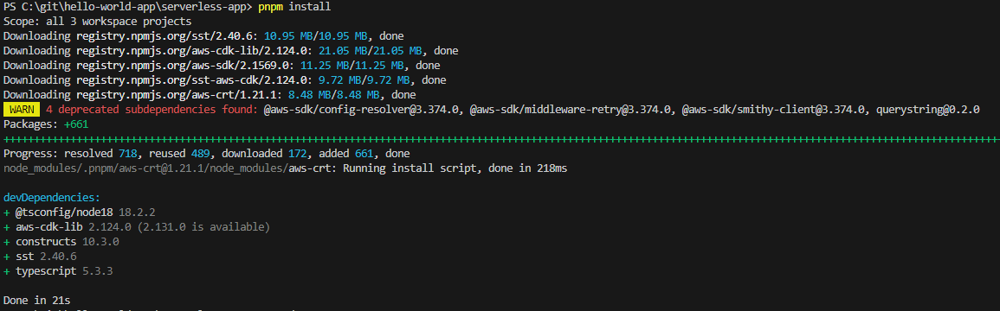
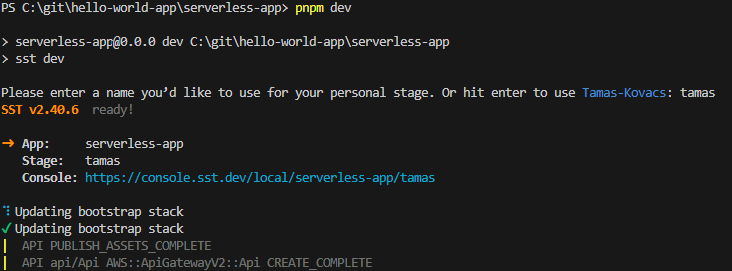

## Getting started

We're using [sst.dev](https://docs.sst.dev/start/standalone) to build our serverless app, particularly "standalone".


## Using the template

1. Replace `serverless-app-template` with your app name `<replace with a service name>`
2. Follow the instructions below as normal

## Prerequisites

1. [pnpm](https://pnpm.io/installation)
2. [AWS cli](https://docs.aws.amazon.com/cli/latest/userguide/getting-started-install.html)
3. [Node](https://nodejs.org/en/download) - at least v18 (later versions should work too)
4. Access to an AWS account

### Development Environment

These instructions are assuming you are using vscode, although you can use any editor you like. We execute the commands below in a bash terminal window in vscode, there may be some differences in the commands if using powershell so bash is recommended. You probably always want to run your commands in bash, to achieve this, uncomment the `script-shell` setting in [.npmrc](.npmrc).

### Login to AWS programmtically
In your bash terminal, run `aws configure sso` and set the following settings in the prompts:

```bash
SSO session name (Recommended): sandbox
SSO start URL [None]: https://flpdsh.awsapps.com/start
SSO region [None]: eu-west-1
SSO registration scopes [sso:account:access]:
```

Switch to the browser window and follow instructions and when you return to the terminal, choose your profile, e.g. `sandbox-learning`.

Continue with the final configuration:

```bash
CLI default client Region [None]: eu-west-1
CLI default output format [None]:
```

This sets the AWS_PROFILE environment variable to the profile provided. This informs the AWS CLI and other AWS tools to use the credentials and configuration associated with the profile.

As suggested, run:

`aws s3 ls`

You should get some s3 buckets listed!

```bash
2023-11-20 10:37:19 cdk-hnb659fds-assets-441690560197-eu-west-1
2024-02-27 17:47:11 cdk-hnb659fds-assets-441690560197-us-east-1
2023-11-10 09:55:10 cf-templates-1ajgvs5q5wk52-eu-west-1
2024-02-13 13:57:12 datadog-failed-data-bucket-441690560197
2023-11-21 13:25:12 datadog-failed-metrics-data-bucket-441690560197
2023-11-08 13:50:35 sstbootstrap-euwest1facae36a-utedawo9bmtp
2024-02-27 17:47:10 sstbootstrap-useast124d14e4b-wnfb6zeyharw
```

You're connected to AWS 🎉


### Extra AWS configuration (optional)

Although `aws configure sso` does the job, you might want to set your profile explicitly and manage your profiles yoursefl.  If you look into your `~/.aws/config` file, you will see the profile name you used to login.

```bash
[profile sandbox]
sso_account_id = <Your account number>
sso_role_name = AWSAdministratorAccess
region = eu-west-1
output = json
sso_start_url = https://flpdsh.awsapps.com/start
sso_region = eu-west-1
sso_registration_scopes = sso:account:access
```

Add the following to `~/.bashrc` or `~/.zshrac` (if you're using zsh) to set the profile automatically when you open a new terminal session:

```bash
export AWS_PROFILE=<your-default-profile-name>
```

Any new terminals sessions will pick this setting up automatically. To load this in an existing shell, run `source ~/.bashrc`. To check what profile you're using, run:

```bash
echo $AWS_PROFILE
```

## Run the app

Start the sst app:

```bash
pnpm install
pnpm dev
```



After install, `pnpm dev` will start the app. The first time you run this, it will ask you for a stage name. Pick a sensible name, e.g. your name - this is a personal stack deployed to AWS.When you deploy the stack for the first time, `sst` will run some some tasks, e.g. "bootrsap stack". So expect it to take around 2-3 mins max - you will hardly have time to grab a coffee ☕️



Your app is now running locally. You can hit the endpoint in your browser or using curl 🙌


## Troubleshooting

If you see an error that looks like the following ("is not recognized as an internal or external command" in particular), this means that `pnpm` is running commands usiung `PowerShell`, and not `bash`. This is configured by the `shell-script` setting, which can be configured in [.npmrc](.npmrc), don't forget to uncomment the `script-shell` setting in [.npmrc](.npmrc).

```bash
'AWS_SDK_LOAD_CONFIG' is not recognized as an internal or external command,
operable program or batch file.
 ELIFECYCLE  Command failed with exit code 1.
```